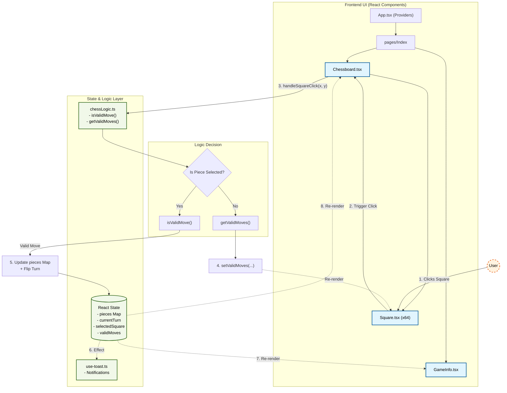

# ♟️ ChessVerse Battlefield

> A polished, fully-playable local-multiplayer chess game built entirely in the browser — no server, no account, no downloads required.

[](https://reactjs.org/)
[](https://vitejs.dev/)
[](https://www.typescriptlang.org/)
[](https://tailwindcss.com/)

🌐 **Live Demo:** [https://cheeseverse.netlify.app/](https://cheeseverse.netlify.app/)

---

## 📌 Table of Contents

1. [Problem Statement](#-problem-statement)
2. [What It Solves](#-what-it-solves)
3. [Features](#-features)
4. [Architecture & Data Flow](#-architecture--data-flow)
5. [Component Breakdown](#-component-breakdown)
6. [Chess Logic Deep Dive](#-chess-logic-deep-dive)
7. [Tech Stack](#-tech-stack)
8. [Project Structure](#-project-structure)
9. [Getting Started](#-getting-started)
10. [Deployment](#-deployment)

---

## 🧩 Problem Statement

Chess is one of the most enduring strategy games in human history, yet most digital implementations either:

- **Require an account or online connection** to play with a friend sitting next to you.
- **Are cluttered with ads, social features, and paywalls** that get in the way of simply playing the game.
- **Lack visual clarity** — move hints, capture highlights, and turn indicators are often buried or missing entirely.
- **Are closed-source black boxes** — difficult for developers to learn from or embed.

There was a clear gap for a **lightweight, open, dependency-free chess experience** that works instantly in any modern browser and can be run locally or self-hosted.

---

## ✅ What It Solves

ChessVerse Battlefield provides:

| Problem | Solution |
|---|---|
| Needing an account to play locally | Fully local pass-and-play multiplayer — zero sign-up required |
| Cluttered chess UIs | Minimal, distraction-free interface focused on the board |
| No move feedback | Green dot overlays on valid destination squares; red highlight on captures |
| Opaque piece state | Selected piece is visually scaled and highlighted |
| No turn awareness | Prominent "Current Turn" indicator with animated badge |
| Heavy external libraries | Chess rules implemented from scratch — no `chess.js` or similar runtime dependency |

---

## ✨ Features

- ♟️ **Full standard chess piece movement** — Pawn, Rook, Knight, Bishop, Queen, King
- 🟢 **Valid move highlighting** — animated green dots indicate legal destination squares
- 🔴 **Capture highlighting** — red overlay marks the captured square
- 🔵 **Selected piece scaling** — selected pieces scale up for clear visual feedback
- 🔔 **Toast notifications** — move and capture announcements appear in a non-blocking overlay
- 🔊 **Sound effects** — audio cues for selection (`select.mp3`) and movement (`move.mp3`)
- 🎨 **Dark/light aware theming** — Tailwind CSS custom design tokens
- ⚡ **Blazing fast** — Vite + SWC compilation, no backend latency

---

## 🏗️ Architecture & Data Flow

### System Architecture



### Interaction Sequence

```text
User clicks a square
        │
        ▼
handleSquareClick(x, y)          ← Chessboard.tsx
        │
  ┌─────┴──────────────────┐
  │ No piece selected yet? │
  └─────┬──────────────────┘
        │ Yes — select piece
        ▼
getValidMoves(pos, piece, board) ← chessLogic.ts
        │
  setValidMoves([...])           ← triggers re-render with green hints
        │
  User clicks destination
        ▼
isValidMove(from, to, piece, board) ← chessLogic.ts
        │
  Update pieces Map + flip turn
        │
  Toast notification + sound
        │
  GameInfo re-renders with new turn
```

---

## 🧱 Component Breakdown

- **`App.tsx`**: The root wrapper setting up global contexts (`QueryClientProvider`, `TooltipProvider`, `BrowserRouter`, `Toaster`).
- **`pages/Index.tsx`**: The main view layout. Manages the `currentTurn` state so it can be passed to the sidebar independently of the board.
- **`components/Chessboard.tsx`**: The core controller. Manages the board state (`Map<string, ChessPiece>`), handles the two-phase click selection logic, plays sound effects, and triggers turn changes.
- **`components/Square.tsx`**: A pure presentational component representing 1/64th of the board. Receives props to render piece icons, valid move dots, and capture highlights.
- **`components/GameInfo.tsx`**: The sidebar displaying the current turn and game statistics.

---

## ♟️ Chess Logic Deep Dive

All rules are implemented from scratch in `src/utils/chessLogic.ts`.

**Board Representation:**
The board is managed as a React state `Map<string, ChessPiece>` where the keys are coordinate strings `"x,y"` (e.g., `"3,4"`). Empty squares are absent from the map, ensuring O(1) lookups.

**Validation Strategy (`isValidMove`):**
1. Checks board boundaries (0–7).
2. Prevents capturing friendly pieces.
3. Routes to piece-specific validators (`isValidPawnMove`, `isValidKnightMove`, etc.).
4. **Path Obstruction:** Rooks, Bishops, and Queens utilize an `isPathObstructed` helper that walks the grid using normalized direction vectors to ensure pieces don't jump over others.

---

## 🛠️ Tech Stack

- **Core:** React 18, TypeScript 5.5, Vite (SWC)
- **Styling:** Tailwind CSS, Radix UI, `clsx` + `tailwind-merge`
- **UI Components:** shadcn/ui, Lucide React (Icons)
- **State/Routing:** React Router v6, React Query

---

## 📁 Project Structure

```text
src/
├── components/
│   ├── Chessboard.tsx      # Board state & interactions
│   ├── Square.tsx          # Individual cell rendering
│   ├── GameInfo.tsx        # Sidebar UI
│   └── ui/                 # shadcn/ui library components
├── hooks/
│   └── use-toast.ts        # Notification manager
├── pages/
│   └── Index.tsx           # Main application view
├── types/
│   └── chess.ts            # Interfaces (Piece, Move, Position)
└── utils/
    └── chessLogic.ts       # Engine rules and validation
```

---

## 🚀 Getting Started

### Prerequisites
- Node.js ≥ 18

### Local Installation

```sh
# 1. Clone the repository
git clone [https://github.com/Itinerant18/chessverse-battlefield.git](https://github.com/Itinerant18/chessverse-battlefield.git)

# 2. Enter the project directory
cd chessverse-battlefield

# 3. Install dependencies
npm install

# 4. Start the development server
npm run dev
```
Open `http://localhost:8080` in your browser.

---

## ☁️ Deployment

The application is a purely static SPA and can be hosted anywhere. 

**Netlify / Vercel Settings:**
- Build command: `npm run build`
- Publish directory: `dist`

---

## 📄 License

This project is open source. 
```

<FollowUp label="Want to implement Checkmate detection next?" query="How would I implement Check and Checkmate detection in my chessLogic.ts file?" />
